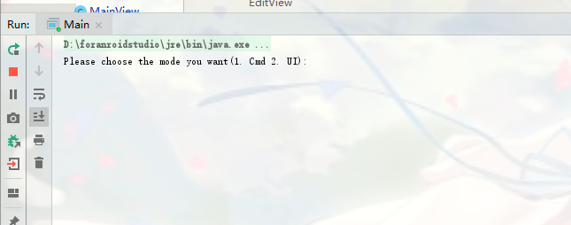
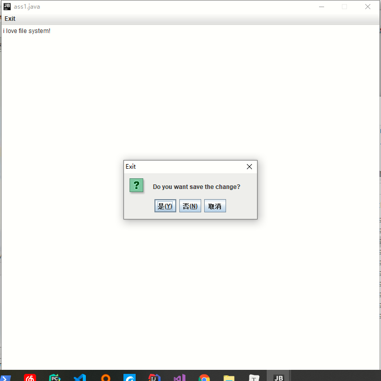
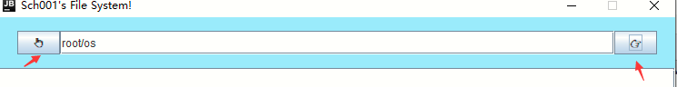
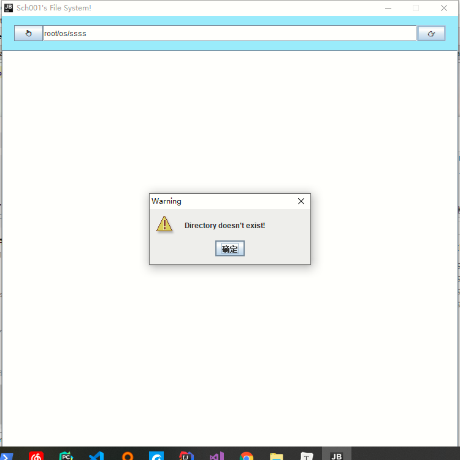
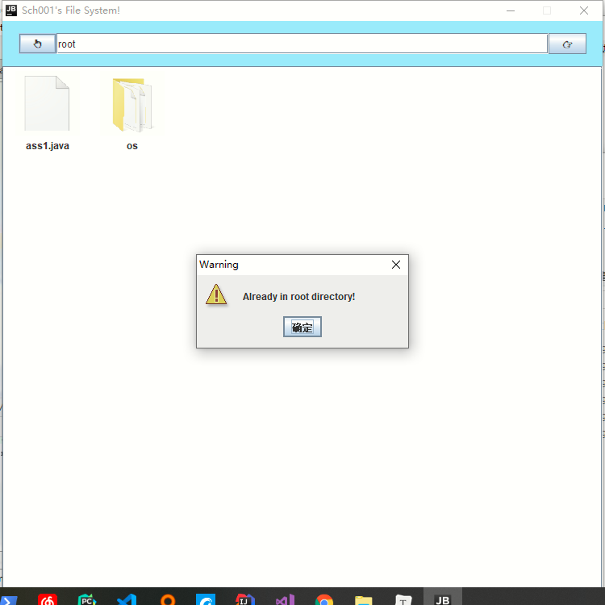
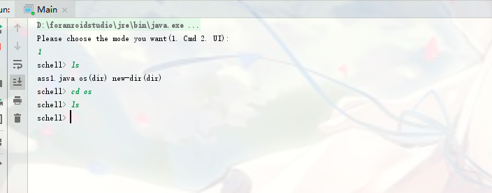
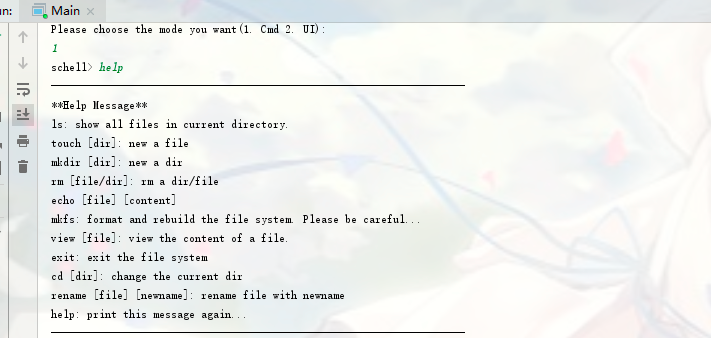
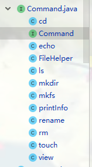

# 操作系统第三次作业 文件系统

> 1651162 施程航

## 需求

- 在内存中开辟空间作为文件存储器，实现一个简单的文件系统。退出文件系统后，要将内容保存在磁盘上，即实现持久化。
- 需要实现要求的多项功能。

## QuickStart

进入命令行，运行以下命令：

```shell
java -jar fs.jar
```

## Overview

我们实现了包括所有要求功能：

- 新建文件/目录
- 删除文件/目录
- 重命名文件/目录
- 格式化
- 显示目录下的所有文件
- 更改当前目录
- 打开文件
- 关闭文件
- 读写文件

并且新增加了：

- 路径查找

另外，在第一次进入系统时，程序会自动初始化文件系统，新建磁盘镜像文件`fs.iso`，并创建根目录`root`。

该文件系统实现了命令行和UI界面两个版本，用户可以自行选择。在进入程序后，你可以通过输入数字来选择文件系统的运行模式：



### 界面版本

选择进入界面版本。


右键点击空白面板，选择格式化、新建文件/目录或回到上一层目录：


选择新建文件目录：


新建目录成功：


新建文件或目录若已经存在同名文件会报错：


右键点击文件,可以选择打开（或者双击打开），进入目录或者编辑文件，取决于该文档是文件还是文件夹；或者选择删除、重命名。


双击或者右键点击文件进入编辑界面：


退出提醒是否保存：



上方还存在工具栏，分别是回到上级目录，地址输入框和前进按钮：



你可以在中间的地址栏输入想去的路径，支持相对路径和绝对路径，当路径不存在时候会提示报错：



当点击回退到父目录时，若当前已经在根目录，提示报错：



### 命令行版本

选择文件系统运行模式时进入命令行版本：



可以看到目录下如果是目录当输入"ls"(显示当前目录的所有文件)时，会在文件名后面显示(dir)。

你也可以通过输入"help"获取帮助信息，获得命令行支持的所有命令：



## 设计

### 文件系统的布局

文件系统在系统上的布局大致如下：

```shell
| 留空块 | 超级块 | i节点位图 | 磁盘块位图 | i节点数组 | 数据块 |
```

从左至右依次有：

- 留空块

  一般文件系统都有一个引导相关的块，这里我们保留了该位置。

- 超级块

  存储文件系统的元信息，如磁盘块总数、i节点总数、位图起始位置等，文件系统初始化时会读取该信息。

- i节点位图

  记录i节点的申请情况。

- 磁盘块位图

  记录磁盘块的申请情况。

- i节点数组

  存储所有i节点的信息，一个i节点默认为64个字节，一个磁盘块可以存储多个i节点。

- 数据块

  从这里开始存储文件的数据块。

### 文件系统的配置

关于文件系统的详细配置可以在`FileSystem.Config.java`中找到：

```java
package FileSystem;

// 这里描述文件系统的基本配置
public class Config {
    //每个磁盘块的大小，字节为单位
    public final static int BlockSize = 1024;
    // i节点的数量，代表文件的最大数量
    public final static int TotalINodeNum = 1024;
    // 磁盘块的总数
    public final static int TotalBlockNum = 1024 * 16;

//    文件名的最大长度
    public final static int FileNameLen = 16;
//    文件直接索引数
    public final static int NDirect = 9;
//    Inode的大小: filename, type, inum, NDirect, INDirect
    public final static int InodeSize  = FileNameLen + (1+ 1+ NDirect+1)* 4;

    public final static int IntSize = 4;
}
```

我们规定文件名不超过16个字符，并且每个文件的**直接索引**为9个，并且其中一个保留为父节点的i节点编号，这意味着每个文件最多有8个直接索引的磁盘块，每个目录最多有8个直接索引的文件。另外，我们保留了间接索引。

### 具体实现

该文件系统借鉴了一点xv6的实现，大致有以下几层：

```shell
------------------------
Controller
------------------------
File and Path Lookup
------------------------
INode(Directory and File)
------------------------
Block and Allocator
------------------------
Underlying FileSystem
------------------------
```

以下是对各层的简述：

- Underlying FileSystem

  FileSystem: 底层文件系统，用`RandomAccessFile`进行模拟，向上提供读取i节点、磁盘块的接口，在这一层还包括了文件系统的布局信息。

  ```java
  public class FileSystem {
  //    镜像文件
      private static File image;
  //    通过storage来访问镜像文件
      private static RandomAccessFile storage;
  //    全局的单例对象
      private static FileSystem instance;
  
  //    对外开放的接口
      static public FileSystem getInstance(){
          if(instance == null){
              initFS();
              if(needToMkfs()){
                  ImageNotGound = false;
                  return null;
              }
  
              instance = new FileSystem();
          }
  
          return instance;
      }
  
  //    存储元信息的超级块
      static SuperBlock superBlock;
  //    位图
      private boolean[] iNodeBitmap;
      private boolean[] blockBitmap;
      ...
  }
  ```

  SuperBlock:存储文件系统的元信息：

  ```Java
  class SuperBlock{
      int totalINodeNum ;//i节点总数
      int totalBlockNum ;//磁盘块总数
  
  //    以下单位均为磁盘块号
      int iBitmapStart;//i节点位图的开始位置
      int bBitmapStart;//磁盘块位图的开始位置
      int iNodeStart;//i节点数组的开始位置
      int blockStart;//数据块的开始位置
      ...
  }
  ```

- Block and Allocator

  Block: 一块磁盘块在内存中的缓冲，读写文件基本上都是通过读写整块磁盘进行。

  ```java
  public class Block {
      byte[] buffer; //缓冲区
      int bnum = -1; // 磁盘块号
      ...
      ...
  }
  ```

  Block Allocator:封装底层接口，实现磁盘块的申请和释放。

- INode(Directory and File)

  INode: i节点，代表一个文件或目录。存储关于文件的所有信息。与xv6不同的一点是，我们的inode有文件名信息。

  index[]数组存放一列id，当INode类型为文件时表示其用来存储数据的磁盘块号，为文件夹时表示目录下i节点编号。

  ```java
  public class INode {
  //    INode的类型，1表示目录，2表示文件
      public int type;
      public byte[] filename = new byte[Config.FileNameLen];
  //    i节点编号
      public int iNum;
  //    如果是目录则代表i节点编号，文件则代表文件块
  //    在这里我们保留了非直接索引的接口，暂未做出实现
      public int[] indexs = new int[Config.NDirect +1];
  
      public byte[] toBytes(){
          ByteBuffer byteBuffer = ByteBuffer.allocate(Config.InodeSize);
          byteBuffer.put(filename);
          if(Config.FileNameLen > filename.length){
              byteBuffer.put(new byte[Config.FileNameLen - filename.length]);
          }
          byteBuffer.putInt(type);
          byteBuffer.putInt(iNum);
          for(int i=0;i<Config.NDirect+1;i++){
              byteBuffer.putInt(indexs[i]);
          }
  
          return byteBuffer.array();
      }
  ```

  

- File and PathLookup

  这一层封装了文件系统的底层实现细节，向上层提供新建/删除/重命名文件和路径查找。

  File:对INode的进一步封装，提供**用户视角**的文件。

  PathLookup:路径查找功能的实现。

- Controller

  Controller: 文件系统启动时的控制中心，指明当前目录。

以上各层是命令行和界面共有的一整套逻辑。

关于命令行版本，我们实现了命令解析器和各种命令(Command Parser and Command):

- CommandParser

  对命令进行解析，分发到对应的Command。

- Command

  Command在我们的实现中是一个interface(接口)：

  ```java
  public interface Command {
      public void execute(Controller controller);
  }
  ```

  这意味着实现了execute(Controller)的都是一条命令，我们实现了以下Command:

  

关于界面，基于Swing我们实现了几个可以复用的组件：

- FileView

  对目录项Dirent的封装

- SPopMenu

  右键文件或者界面空白处的弹出菜单。

- CommandActionListener

  实现对弹出菜单项的监听。

## 其他

### 文件系统的退出

在退出文件系统时，如果是命令行版本，需要键入exit命令进行安全退出，这样新写入的文件信息才会全部返回磁盘，这主要也是为了性能的考虑，文件系统的位图和超级块是常驻内存的。类似的，退出界面版本需要通过关闭窗口而不是强制停止程序，确保信息被正确写入磁盘。

当在输出窗口打印“安全退出！”意味着信息已经被安全写入磁盘。

### 性能上的一些考虑

在实现`FileView`(用户界面的一个目录项显示)时，每个`FileView`都拥有一个弹出菜单`sPopMenu`，我们采用延时创建的方法。即声明一个null的`sPopMunu`成员：

```java
public class FileView extends JPanel {
	...
    private SPopupMenu sPopupMenu = null;//延时创建
	...
}
```

当用户第一次右键单击才对弹出菜单进行实例化，这样对没被用户点击的目录项的弹出菜单就不会被创建。